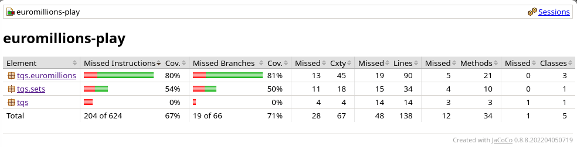
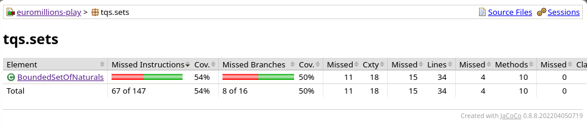
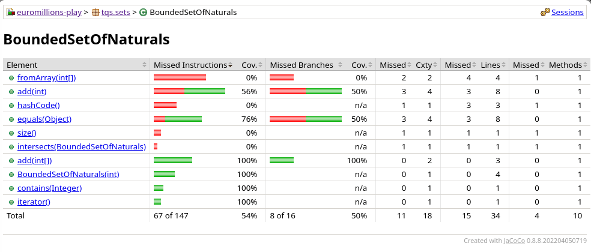
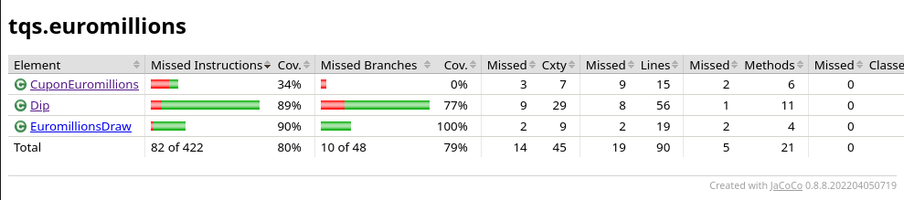
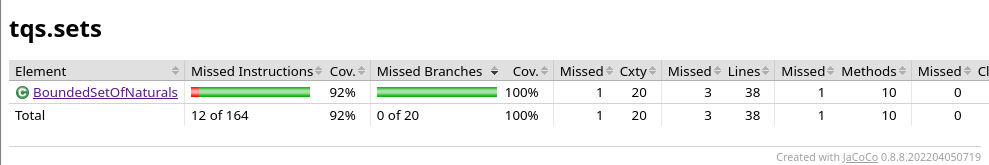
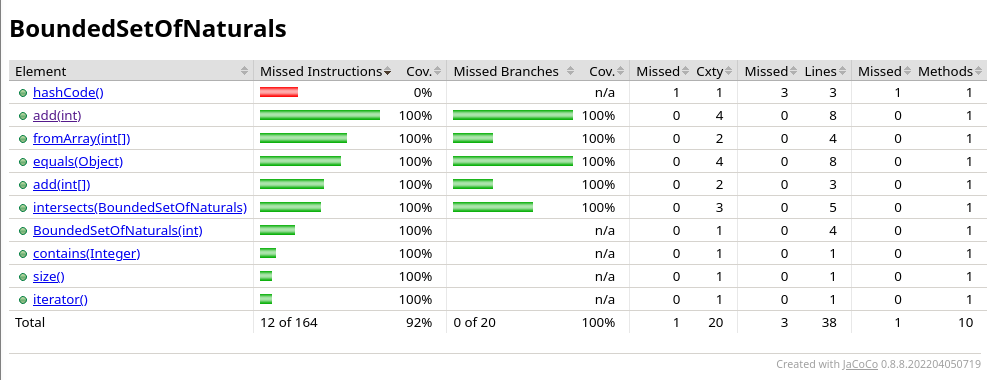

# TQS Lab 1 Ex2

In this exercise we combine the `Junit` testing framework with `JaCoCo`, a library to perform **Code Coverage**, a  software metric that measures the number of code lines executed during automated tests.

## Configuration
In order to use JaCoCo, we need to specify a maven plugin in the `pom.xml` file:

```xml
<plugins>
    <plugin>
        <groupId>org.jacoco</groupId>
        <artifactId>jacoco-maven-plugin</artifactId>
        <version>0.8.8</version>
        <executions>
            <execution>
                <goals>
                    <goal>prepare-agent</goal>
                </goals>
            </execution>
            <execution>
                <id>report</id>
                <phase>prepare-package</phase>
                <goals>
                    <goal>report</goal>
                </goals>
            </execution>
        </executions>
    </plugin>
</plugins>
```
## How to use
To generate the JaCoCo report:
```bash
mvn clean test jacoco:report
```

To see the report:
```bash
cd tqs_labs_euromillion_unit
firefox target/site/jacoco/index.html
```

## The report
Opening the `index.html` file in the browser we can see the following results:


When clicking on `tqs.sets` we see:


and clicking again on `BoundedSetOfNaturals` we see:


### Which classes/methods offer less coverage? Are all possible [decision] branches being covered?
When we step back and look at the JaCoCo report we can see that some functions aren't being covered at all.
When we open the report we can see that **tqs.euromillions** has a coverage of **80%**, **tqs.sets** has a coverage of **54%** and **tqs** has a coverage of **0%**.

Looking deeper at **tqs.euromillions** we find:

-  **CuponEuromillions** class has **34%** coverage, with `format()` and `coundDip()`methods with no written tests;
-  **Dip** class has **89%** coverage, with `hashCod()` method with no written tests and `equals(Object)` partially covered;
-   **EuromillionsDraw** class has **90%** coverage, with `generateRandomDraw()` and `getDrawResults()`methods with no written tests;

### BoundedSetOfNaturals

The set `BoundedSetOfNaturals` has an coverage of **54%** of the code and only **50%** of the branches form if clauses are checked. The methods `fromArray(int[])`, `hashCode()`, `size()` and `intersects(BoundedSetOfNaturals)` have no unit tests written for them, while in the method `add(int)` only **56%** of the code is used in tests and **50%** of the branches in if clauses are used.The `equals(Object)` method has **76%** of the code checked by the tests and **50%** of the branches from if clauses are checked.

I implemented some tests to address the new found issues:

### testAddElement()
- Added testing for the coded exceptions _(add negative number, add to a full set, add a duplicated item)_
- Deleted the code that used sets created with `fromArray()` method, because the cases it covered were already tested and it raised an error that had to do with trying to add an element to a full set.

### testAddFromBadArray()
- Added tests to check exceptions when the array to be added had negative numbers or duplicated items.

### testEquals()
This test checks the equals method defined for the class. It tests comparison with :
- itself or equal arrays;
- objects with different classes;
- _null_

### testIntersect()
For this test, we had to implement the `intersects()` method first.
After implemented, the tests checked if:
- If the sets intersect it returns true;
- If they don't intersect it returns false;
- After adding an element present in both sets, they intersect and return true.

## After
After implementing the previous tests we achieved **92%** of code coverage, with al the branches tested:



This has to do with not implementing tests for the `hashCode()` method, because it is a generated method, so testing it wouldn't make much sense.

