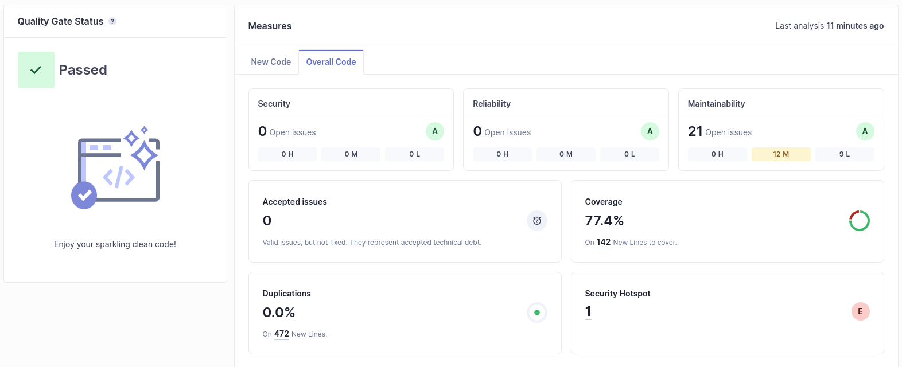
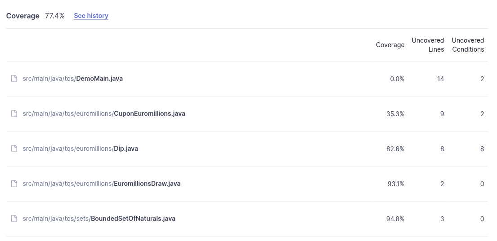

# Lab 6_1

### e) Has your project passed the defined quality gate?
Yes, my code has passed the Quality Gate with **77.4% coverage**.
This is my overall status:



#### Some notes:
The security hotspot is related to Random method by `java.util`
```java
static Random generator = new Random();
```

The **22.6%** uncovered code has to do with the sum of lines uncovered throughout the project, as illustrated bellow:



### f) Explore the analysis results and complete with a few sample issues, as applicable.

| Issue | Problem description | How to solve |
|-------|---------------------|--------------|
|Security Hotspot | Using pseudorandom number generators (PRNGs) is security-sensitive -java:S2245| Use a cryptographically strong random number generator (RNG) like "java.security.SecureRandom" in place of this PRNG.|
|Intentionality - Medium | "Preconditions" and logging arguments should not require evaluation - java:S2629 | Ensure that the arguments passed to logging methods or preconditions checks are either static or pre-computed values, like assign it to a var before parsing it to the method. |
| Intentionality - Medium	 |"for" loop stop conditions should be invariant - java:S127 | Make the termination condition invariant by using a constant or a local variable instead of an expression that could change during the execution of the loop. |
| Intentionality - Medium | Modifiers should be declared in the correct order - java:S1124 | Reorder the modifiers |


